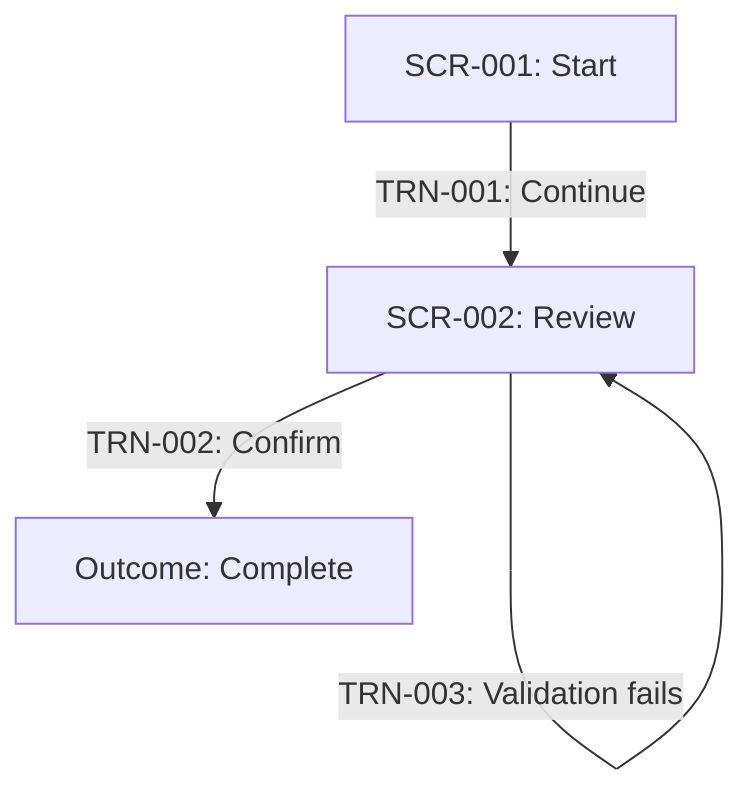

# Screen Specification Artifact Templates

Use all three templates. Keep IDs stable and replace every placeholder with captured content, `Not applicable` plus a reason, or an explicit open question.

## Contents

1. Screen flow
2. Screen catalog
3. Field catalog
4. Review checklist

## Screen Flow

Filename: `SCREEN-FLOW-<slug>.md`

````md
# Screen Flow: <Initiative>

**Slug:** <slug>
**Source:** <path to BRS or requirements artifact>
**Source status:** <Draft | Reviewed | Approved>
**Updated:** <YYYY-MM-DD>
**Status:** Draft

## Scope
<Which user-facing journeys this artifact covers and excludes.>

## Actors
- **<Role>:** <goal and relevant access boundary>

## Source gaps and assumptions
- OQ-### — <unresolved source question and impact>
- ASSUMPTION-001 — <design assumption requiring confirmation>

## Flow index
| ID | Flow | Primary actor | Starts with | Ends with | Source |
|---|---|---|---|---|---|
| FLW-001 | <name> | <role> | <trigger> | <outcome> | SCN-001, BR-001 |

## FLW-001 — <Flow name>

**Goal:** <user goal>
**Actor:** <role>
**Preconditions:** <what must already be true>
**Success outcome:** <observable end state>
**Source:** <BR/SCN/RULE/INFO/QUAL IDs>



### Transitions
| ID | From | Trigger or action | Condition or rule | To / outcome | Failure or alternate behavior | Source |
|---|---|---|---|---|---|---|
| TRN-001 | SCR-001 | ACT-001 | <condition> | SCR-002 | <behavior> | BR-001 |

### Alternate and exception paths
- <Describe cancellation, rejection, timeout, no-access, and recovery paths.>

## Coverage
- **Covered source IDs:** <IDs>
- **Source IDs with no screen flow:** <IDs and reason, such as non-UI requirement>

## Open design questions
- OQ-### or DESIGN-OQ-001 — <question> (owner: <role or Unassigned>)
````

## Screen Catalog

Filename: `SCREEN-CATALOG-<slug>.md`

````md
# Screen Catalog: <Initiative>

**Slug:** <slug>
**Source:** <path to BRS or requirements artifact>
**Updated:** <YYYY-MM-DD>
**Status:** Draft

## Screen inventory
| ID | Screen | Purpose | Roles | Used by flows | Source |
|---|---|---|---|---|---|
| SCR-001 | <name> | <one-line purpose> | <roles> | FLW-001 | BR-001, SCN-001 |

## SCR-001 — <Screen name>

**Purpose:** <why this screen exists>
**Traceability:** <BR/SCN/RULE/INFO/QUAL IDs>
**Roles and access:** <who can view or act>
**Entry conditions:** <how and when the screen is reached>
**Exit outcomes:** <destinations or completed outcomes>

### Information hierarchy
1. <Primary heading, status, or decision information>
2. <Main content or task>
3. <Supporting context>

### Actions
| ID | Label / intent | Roles | Available when | Result or transition | Source |
|---|---|---|---|---|---|
| ACT-001 | <action> | <role> | <condition> | TRN-001 | RULE-001 |

### States
| State | What is shown | Available actions | Recovery or next step |
|---|---|---|---|
| Default | <content> | <actions> | <next step> |
| Loading | <feedback> | <actions> | <timeout/retry> |
| Empty | <explanation> | <actions> | <next step> |
| Validation error | <field/summary feedback> | <actions> | <correction> |
| System error | <safe message> | <actions> | <retry/support> |
| No access | <explanation> | <actions> | <request/return> |
| Read-only | <content> | <actions> | <next step> |
| Success | <confirmation> | <actions> | <next step> |

### Low-fidelity wireframe
```text
+--------------------------------------------------+
| <Page title>                         <Status>     |
+--------------------------------------------------+
| <Context / guidance>                             |
|                                                  |
| <Primary content or fields>                      |
|                                                  |
+--------------------------------------------------+
| <Secondary action>              <Primary action> |
+--------------------------------------------------+
```

### Notes and assumptions
- ASSUMPTION-### — <assumption>
- <Accessibility, responsive, privacy, audit, or content notes when known>
````

## Field Catalog

Filename: `FIELD-CATALOG-<slug>.md`

```md
# Field Catalog: <Initiative>

**Slug:** <slug>
**Source:** <path to BRS or requirements artifact>
**Updated:** <YYYY-MM-DD>
**Status:** Draft

## Field summary
| ID | Label / value | Screen(s) | Mode | Required when | Source |
|---|---|---|---|---|---|
| FLD-001 | <label> | SCR-001 | Input | <condition> | INFO-001, RULE-001 |

## FLD-001 — <Field label or value>

- **Business meaning:** <what this information means>
- **Screen(s):** <SCR IDs>
- **Mode:** Display | Input | Select | Derived
- **Required when:** <condition or Never>
- **Editable by:** <roles or Not editable>
- **Format / example:** <business format and example>
- **Allowed values / source:** <list, reference source, or Not constrained>
- **Validation:** <business validation and message intent>
- **Default / derivation:** <rule or None>
- **Sensitivity:** Public | Internal | Confidential | Restricted | Not classified
- **Retention / audit note:** <when known>
- **Traceability:** <INFO/RULE/BR/SCN/QUAL IDs>
- **Assumptions / open questions:** <IDs or None>

## Cross-field rules
- RULE-### — <relationship, calculation, conditional requirement, or validation involving multiple fields>

## Coverage
- **Information needs covered:** <INFO IDs>
- **Information needs not represented as fields:** <IDs and reason>
```

## Review Checklist

- Every main and exception scenario has a flow or a documented non-UI disposition.
- Every screen has a purpose, roles, states, actions, and source traceability.
- Every action has an outcome, transition, or local effect.
- Every transition has failure or alternate behavior where relevant.
- Every information need is represented by a field/value or explicitly excluded.
- Every business rule is reflected in flow conditions, action availability, field rules, or a documented non-UI behavior.
- Every relevant operational quality is reflected in states, access, content, timing, audit notes, or an explicit non-UI disposition.
- Permissions, sensitive information, notifications, audit needs, and accessibility constraints are not silently omitted.
- Assumptions and unresolved questions are visible and assigned where possible.
- The artifacts describe behavior without prescribing architecture or production code.
